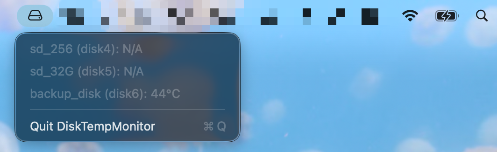

# ExternalDiskTempMonitor

*[阅读中文版说明 (简体中文)](README_zh.md)*

ExternalDiskTempMonitor is an external hard drive temperature monitoring tool designed specifically for macOS. It monitors the temperatures of external drives connected to your Mac in real-time and displays them in the top menu bar.

## Features



- **Minimalist & Zero-Distraction**: A clean, native macOS external drive icon (`externaldrive`) is the only thing shown in the menu bar. 
  > **💡 Pro Tip**: Simply click the hard drive icon in the menu bar to reveal a drop-down menu containing the full names and real-time temperatures of all connected external drives!
- **Detailed Status Reports**: The drop-down menu displays the **full volume name** and real-time temperature of all connected external drives.
- **Smart Idle State**: When no external drives are connected, the menu bar only displays the icon. Clicking it will show `///No Ex Disk///` in the drop-down menu.
- **Great Device Compatibility**: Intelligently identifies devices without native SMART sensors (like SD cards) and displays their temperature as `N/A` in the drop-down rather than improperly hiding them.

## Requirements

1. macOS (Supports both Apple Silicon and Intel).
2. **Core Requirement**: You MUST install **smartmontools** (for low-level data reading):
   ```bash
   brew install smartmontools
   ```

*(If you use the **Recommended 1-Click Install** below, you **DO NOT** need to install a development environment or git clone anything!)*

## Installation & Usage

### Recommended: 1-Click Quick Install (No Compilation Needed)

Open the Mac **Terminal**, completely copy and paste the single line command below, and press Enter. This command will automatically download the pre-compiled software, install it directly to `/Applications` (saving you the hassle of compiling from source), and configure it to start at boot:

```bash
curl -sL https://raw.githubusercontent.com/BingkangShi/ExternalDiskTempMonitor/main/install_release.sh | bash
```

### Method 2: Manual Clone & Install

If you have cloned (or plan to clone) the code repository locally, navigate to the project directory in your terminal and run:
```bash
./install.sh
```

**The installation script will automatically perform the following operations:**
1. Compile `main.swift` into an executable `ExternalDiskTempMonitor.app`.
2. Install the application to the system's `/Applications/ExternalDiskTempMonitor.app`.
3. Terminate any historically running instances of the application.
4. **Auto-start Configuration**: Automatically generate and load the corresponding `.plist` daemon file in `~/Library/LaunchAgents`.

### How to Enable Auto-Start at Login (Enabled by Default)
The `install_release.sh` and `install.sh` scripts will **automatically enable** auto-start for you during installation.
The core principle is creating a configuration file at `~/Library/LaunchAgents/com.user.externaldisktempmonitor.plist` and calling `launchctl load`. The system will automatically open this application in the background every time you log in.

### How to Disable Auto-Start
If you no longer wish for it to start automatically at boot, you can cancel it using the following commands:
```bash
launchctl unload ~/Library/LaunchAgents/com.user.externaldisktempmonitor.plist
# Remove the daemon file
rm ~/Library/LaunchAgents/com.user.externaldisktempmonitor.plist
```
*(After disabling auto-start, you can still manually launch it by double-clicking `ExternalDiskTempMonitor.app` in your **Applications** folder)*

## Uninstallation
1. Stop the current process:
   Click the hard drive icon in the top menu bar to trigger the drop-down menu, then click `Quit ExternalDiskTempMonitor`.
2. Remove the auto-start configuration file (as shown above).
3. Go to the `/Applications/` folder and delete `ExternalDiskTempMonitor.app`.
